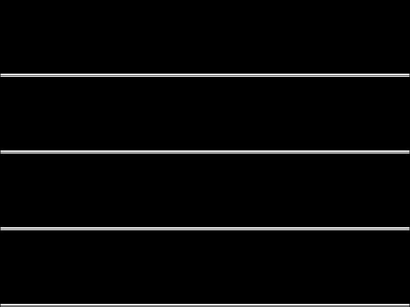

# 一种基于频率域失真和空间域失真的J-UNIWARD隐写算法

该程序文件包含我们在报告中使用的隐写代码、用于图像评价的代码以及我们的实验结果以助于实验结果的复现。

## Dependencies

* matlab图像处理工具箱
* JPEG工具箱

我们的方法还参考了以下链接

* J-UNIWARD隐写算法的实现 http://dde.binghamton.edu/download/syndrome/  
* J-UNIWARD隐写算法的实现 https://github.com/wangfeng22/CIHC-2019/ 
* 三点嵌入隐写算法实现 https://github.com/kalpatian/information_hidding 


## Dataset Preparation

* 我们使用官网给定图片和文本作为对比试验数据。 图片存储在mytest.jpg，文本存储在2.txt中。
* 同时我们生成了随机的字符文本作为其他对比数据测试我们方法的泛化性。随机字符文本存储在1.txt中。


## Usage
下面我们介绍我们方法的使用
### Encryption & Decryption

我们在example.m文件中实现对图像的隐写和解密。
加密过程：
```
for i=1:n
    COVER=image_name;
    STEGO=['stego_',image_name];
    [S_STRUCT,a] = J_UNIWARD(COVER,payload,msg');
```
保存图片，然后重新进行解密，我们可以观察error判断是否解密出错。
```
    C_STRUCT = jpeg_read(image_name);
    C_STRUCT.coef_arrays{1} = S_STRUCT.coef_arrays{1};
    jpeg_write(C_STRUCT,STEGO);
    fprintf(['第 ',num2str(i),' 幅图像-------- ok','\n']);
    C_test = jpeg_read(STEGO);
    stego = reshape(C_test.coef_arrays{1},[1,600*800]);
    extr_msg = stc_ml_extract(int32(stego), uint32(a),10);%信息提取
    error=sum(msg'~=extr_msg);%验证信息是否正确嵌入```
```

### Design of the distortion loss
我们在J_UNIWARD.m文件中定义失真函数的设计。你可以在这里选择失真函数基于频率、基于空间域或是基于二者。
```
cover=C_COEFFS(:);
costs=zeros(3,k*l,'single');
costs(1,:)=rhoM1(:);
costs(3,:)=rhoP1(:);
%costs(1,:)=PicEdge*3000;
%costs(3,:)=PicEdge;
%costs = costs.*PicEdge;
imagesc(reshape(costs(1,:),[600,800]))%画图
```
### Evaluate
在文件fenge.m我们定义了计算PSNR和SSIM图片质量的代码。


## experimental result

* 对比实验文件夹包括三种对比方法的图片以及我们提出的基于边缘检测的隐写方法和基于于频率域失真和空间域失真的方法。
* 消融实验文件夹保存了对随机bit进行隐写的结果图片。
* 以上结果均可使用fenge.m进行图像质量分析。
* 我们还进行了丰富的可视化，具体包括边缘检测的可视化以及不同丰富失真损失的热力图展示。
* 实验的所有数值结果在实验.xlsx中记录。




